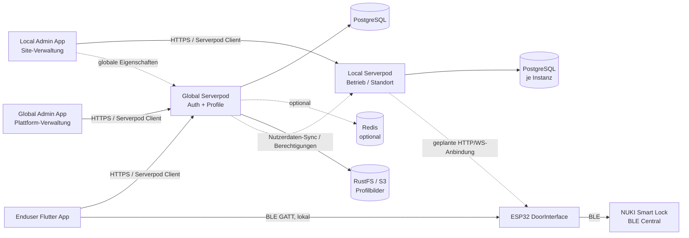
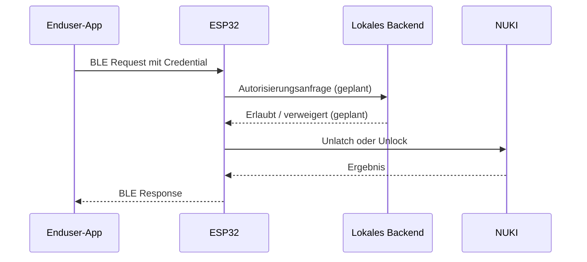

# top_attempt

## Projektüberblick

`top_attempt` ist ein Monorepo für eine digitale Türzugangslösung. Ein
ESP32 steuert den lokalen Türzugang und kommuniziert mit NUKI-Schlössern.
Smartphone-Clients nutzen BLE für die lokale Interaktion. Serverpod-Backends
stellen die zentrale Benutzer- und Profildatenbasis sowie den geplanten
lokalen Vermittlungsdienst bereit.

Der wichtigste Architekturgrundsatz lautet: **Der Türzugang bleibt lokal und
funktioniert ohne Cloud-Roundtrip; zentrale Dienste ergänzen Authentifizierung,
Profile, Berechtigungen und Verwaltung.**

Das Projekt wird zu einem **ERP-System für Betriebe** ausgebaut: Jede
lokale Instanz bildet einen Betrieb ab (Selbsteinlass, später
Kursverwaltung, Angestelltenverwaltung, Schichtplan); die globale Instanz
ist die zentrale Plattform-Ebene (Benutzerkonten, Profile), über die
Betriebe von außen erreicht werden können.

## Inhaltsverzeichnis

- [Systemarchitektur](#systemarchitektur)
- [Komponenten](#komponenten)
- [Szenarien](#szenarien)
- [Schnittstellen](#schnittstellen)
- [Daten und Sicherheit](#daten-und-sicherheit)
- [Aktueller Stand](#aktueller-stand)
- [To-dos](#to-dos)
- [Entwicklung und Betrieb](#entwicklung-und-betrieb)
- [Bekannte Risiken](#bekannte-risiken)

## Systemarchitektur

### Zielbild



### Instanz-Modell

- **Globale Instanz** (`apps/backends/global/`): die eine zentrale
  Plattform-Instanz. Enduser registrieren sich hier; hier leben
  Benutzerkonten und Profile.
- **Lokale Instanz** (`apps/backends/local/`): **eine Instanz pro
  Betrieb/Standort**. Bildet den Betrieb ab (Türzugang, später ERP)
  und muss bei kurzer Internettrennung autark weiterlaufen.
- **Zusammenspiel**: Mitglied eines Betriebs wird man global
  (Registrierung) und lokal (Einschreiben bei der Instanz); die lokale
  Instanz erhält die nötigen Nutzerdaten synchronisiert. Details
  (User-/Login-Modell, Umfang der Synchronisation) sind offene
  Architekturfragen — siehe `apps/AGENTS.md` → „Offene
  Architekturfragen“.

Ziel-Ablauf „Selbsteinlass“: QR-Code an der Location scannen → OTP
abfragen → OTP per BLE an den ESP32 → ESP32 an lokale Instanz → Instanz
prüft Zugangsdaten → Tür schaltet (über ESP32/NUKI).

### Ist-Verbindungen und geplante Verbindungen

| Verbindung | Status | Beschreibung |
|---|---|---|
| Flutter Enduser → Global | implementiert | Serverpod Client, Auth und Profilverwaltung |
| Flutter Enduser → ESP32 | Prototyp implementiert | BLE-Scan/QR-Ziel, GATT-Testrequest, Mock-Antwort |
| ESP32 → NUKI | implementiert | Pairing, Lock/Unlock/Unlatch, Status und Batterie |
| ESP32 → Local Serverpod | offen | Architekturentscheidung und Protokoll fehlen |
| Global → Local | offen | Nutzer-Sync, Geräte- und Berechtigungsmodell fehlen (Login-Modell offen) |
| Local Admin App → Local | Scaffold | App vorhanden, Backend-Domäne fehlt noch |
| Global Admin App → Global | Scaffold | App vorhanden, Admin-Domäne fehlt noch |
| ESP32 → GitHub Release | implementiert | Manuelles OTA-Update aus dem neuesten Release |

## Komponenten

### `doorinterface/`: ESP32-Firmware

PlatformIO-Projekt für `esp32dev` mit Arduino-Framework.

- `WifiManager`: WLAN-STA, AP-Fallback, Captive Portal, DNS, NVS-Credentials
  und konfigurierbarer Hostname.
- `WebInterface`: lokale Weboberfläche, mDNS und JSON-HTTP-API.
- `NukiManager`: NUKI-BLE-Central, Pairing, Zustandsabfrage und Aktionen.
- `BleServer`: BLE-Peripheral für die Smartphone-App.
- `Updater`: OTA über GitHub Releases.
- `src/web/`: HTML, CSS und JavaScript als PROGMEM; kein LittleFS.
- `lib/nuki_ble/`: gepatchter Fork von `NukiBleEsp32` für NimBLE-Arduino 1.4.x.

Die BLE-Initialisierung erfolgt erst nach erfolgreicher WLAN-Verbindung und
dem Abschalten des Setup-APs. Damit wird der gemeinsame 2,4-GHz-Funk des ESP32
nicht durch parallelen AP- und BLE-Start blockiert. `BleServer` und
`NukiManager` verwenden denselben NimBLE-Stack, aber unterschiedliche Rollen.

### `apps/backends/global/`: globaler Dienst

Serverpod-Backend auf den Ports 8080/8081/8082 in der Entwicklung.

- E-Mail-Identity-Provider für Registrierung, Login und Passwort-Reset.
- JWT-basierte Authentifizierung.
- `ProfileDetailsEndpoint` für Vorname, Nachname und Geburtstag.
- `UserProfileEditEndpoint` für E-Mail/User-ID/Profilbild über das Auth-Modul.
- RustFS als öffentliches S3-kompatibles Storage für Profilbilder.
- Generierter Global-Client für Flutter.

### `apps/backends/local/`: lokaler Dienst

Serverpod-Backend auf den Ports 8180/8181/8182 in der Entwicklung
(Postgres 8190, RustFS-Konsole 9101). Eine Serverpod-Instanz pro
Betrieb/Standort; bildet den Betrieb ab und soll autark bei kurzer
Internettrennung laufen. Seit dem Serverpod-4-Upgrade (2026-09-23)
strukturgleich mit dem globalen Backend (E-Mail-IdP, JWT,
`ProfileDetailsEndpoint`, RustFS-Storage) — das Geräte-, Mitglieder-
und Berechtigungsmodell ist noch nicht implementiert. Offene Fragen
(User-/Login-Modell `staff` vs. `members`-Tabelle, ESP32-Protokoll):
siehe `apps/backends/local/AGENTS.md`.

### `apps/frontends/top_attempt_enduser_flutter/`

Enduser-App mit GoRouter, Serverpod Auth und `flutter_blue_plus`.

- Login über den globalen Server.
- Guard für Pflichtprofilfelder.
- Profil mit Bild, Name, Geburtstag, E-Mail, Auth-ID und QR-Code.
- QR-Reader für das geplante Format `doorinterface|MAC|Token`.
- BLE-Verbindungstest mit Service Discovery, Notify-Subscription,
  Request-Write, Timeout und sauberem Disconnect.

Der BLE-Flow sendet aktuell immer `action: test` und prüft keine Credentials.

### `apps/frontends/top_attempt_flutter/`

**Kopiervorlage**: rohes Serverpod-Grundgerüst ohne eigenen Zweck; wird
kopiert, wenn ein weiteres Frontend benötigt wird. Wird von den
`flutter_build`-Skripten beider Backends noch als Web-App-Quelle
referenziert (To-do).

### `apps/frontends/top_attempt_global_flutter/`

**Plattform-Admin-App** zur Verwaltung der globalen Instanz
(Nutzerkonten/Profile, später mehr). Aktuell rohes Serverpod-Scaffold
(SignIn/Greetings), noch keine Admin-Domäne.

### `apps/frontends/top_attempt_local_flutter/`

**Site-Admin-App** zur Verwaltung einer lokalen Instanz: Geräte, Nutzer
vor Ort, Zugangsrechte; später ERP-Ausbau (Kursverwaltung,
Angestelltenverwaltung, Schichtplan). Aktuell rohes Serverpod-Scaffold;
bindet bewusst beide Clients ein (global + local), da sie auch globale
Eigenschaften manipulieren soll (z. B. Kursverwaltung — Global-vs.-lokal
ist noch offen).

## Szenarien

### 1. Erstinbetriebnahme eines ESP32

1. ESP32 startet und lädt Hostname sowie WLAN-Credentials aus NVS.
2. Bei fehlenden oder ungültigen Daten startet `DoorSetup-AP`.
3. Das Captive Portal scannt WLANs und nimmt SSID, Passwort und optionalen
   Hostnamen entgegen.
4. Der ESP32 versucht die Verbindung und zeigt die STA-IP an.
5. Nach manueller Bestätigung oder 30 Sekunden wird der Setup-AP beendet.
6. Die lokale Oberfläche ist per IP oder mDNS (`<hostname>.local`) erreichbar.

### 2. NUKI koppeln

1. NUKI in den Bluetooth-Pairing-Modus versetzen.
2. In der lokalen Setup-Seite „Pairing starten“ auslösen.
3. Der ESP32 scannt bis zum Erfolg oder maximal zehn Minuten.
4. NUKI-Credentials werden durch die Bibliothek in NVS gespeichert.
5. Danach fragt der ESP32 den Keyturner-Status ab und zeigt Zustand, Batterie
   und RSSI an.
6. Pairing kann abgebrochen oder ein Lock entkoppelt werden.

Für NUKI Ultra, Go, 5.0 und Pro wird vor dem Pairing eine sechsstellige PIN
über die Setup-Seite gespeichert. Standard-Locks 1.0 bis 4.0 benötigen sie
nicht.

### 3. Lokale BLE-Testsession

1. Enduser-App scannt einen QR-Code oder erhält eine BLE-Remote-ID.
2. App verbindet sich mit dem ESP32 und entdeckt den DoorInterface-Service.
3. App abonniert die Response-Characteristic.
4. App schreibt JSON auf die Request-Characteristic.
5. ESP32 antwortet per Notify und trennt anschließend die Verbindung.

Im aktuellen Prototyp ist `test` echt, `open` jedoch nur eine Mock-Antwort.
Eine Credential-Prüfung und tatsächliche Autorisierung fehlen.

### 4. Türöffnung im Zielsystem



Die gestrichelten Schritte sind noch nicht Bestandteil des implementierten
Systems.

## Schnittstellen

### BLE GATT

Die vollständige Prototollbeschreibung steht in
[`doorinterface/docs/ble_interface.md`](../doorinterface/docs/ble_interface.md).

| Element | UUID | Richtung |
|---|---|---|
| Service | `5f6d4f5a-0001-0001-8000-00805f9b34fb` | DoorInterface |
| Request | `5f6d4f5a-0002-0001-8000-00805f9b34fb` | App → ESP, Write |
| Response | `5f6d4f5a-0003-0001-8000-00805f9b34fb` | ESP → App, Notify |

Beispielrequest:

```json
{"action":"test","credential":"","deviceId":"flutter-enduser"}
```

Beispielresponse:

```json
{"success":true,"code":"TEST_OK","message":"Test empfangen: flutter-enduser"}
```

Der Prototyp nutzt UTF-8-JSON ohne Chunking bei einem vorgesehenen MTU von
128. Es gibt derzeit keine BLE-Verschlüsselung.

### ESP32 HTTP-API

Die lokale API ist nicht authentifiziert und nur im lokalen Netz verfügbar.

| Bereich | Routen |
|---|---|
| Status | `GET /api/status`, `GET /api/ble/info` |
| Gerät | `GET/POST /api/hostname`, `POST /api/reboot` |
| NUKI | `POST /api/nuki/pair`, `/cancel`, `/unlock`, `/lock`, `/open`, `/unpair` |
| NUKI-Konfiguration | `GET/POST /api/nuki/pin`, `GET/POST /api/nuki/poll` |
| OTA | `POST /api/update/check`, `POST /api/update/start`, `GET /api/update/progress` |

### Globales Backend

Die relevanten Serverpod-Endpoints sind:

- `emailIdp`: Login, Registrierung und Passwort-Reset (identisch für local).
- `jwtRefresh`: Access-Token erneuern.
- `userProfileEdit`: Profil lesen, Bild setzen/entfernen, Namen ändern (nur global).
- `profileDetails`: authentifiziertes Lesen und Speichern von Name/Geburtstag
  (global und local).

`ProfileDetailsEndpoint` verlangt Login, begrenzt Namen auf 1 bis 60 Zeichen
und akzeptiert Geburtstage nur zwischen 1900 und gestern.

## Daten und Sicherheit

### Speicherung

| Daten | Speicherort |
|---|---|
| WLAN und Hostname | ESP32 NVS (`wifi`, `system`) |
| NUKI-Schlüssel/Auth-ID | NVS der NUKI-Bibliothek, Namespace nach Gerätename |
| Name/Geburtstag | PostgreSQL, `profile_details` |
| Profilbild | RustFS-Bucket `top-attempt` |
| Auth-Sessions | Serverpod Auth/JWT plus Datenbank |

### Sicherheitslage

Der aktuelle Stand ist ein Entwicklungsprototyp:

- ESP32-Weboberfläche besitzt keine Login-/Session-Authentifizierung.
- BLE-Characteristics sind nicht verschlüsselt oder authentifiziert.
- BLE-`credential` wird nur angenommen und nicht geprüft.
- OTA verwendet `WiFiClientSecure.setInsecure()` statt Zertifikatsprüfung.
- E-Mail-Verifizierungscodes werden in der Entwicklung nur geloggt.
- Entwicklungszugänge stehen derzeit teilweise in Compose-/CI-Konfigurationen
  und müssen vor einer Veröffentlichung in Secrets ausgelagert und rotiert
  werden.
- Berechtigungen, Gerätezuordnung und Audit-Logging fehlen.

Vor einem Produktiveinsatz müssen mindestens BLE-/Backend-Authentifizierung,
TLS-Zertifikatsprüfung, sichere Secrets, Replay-Schutz und ein abgesichertes
lokales Admin-Interface umgesetzt werden.

## Aktueller Stand

| Teilbereich | Reifegrad | Einordnung |
|---|---|---|
| ESP32 WLAN/Setup | funktionsfähiger Prototyp | Captive Portal und NVS vorhanden |
| ESP32 lokale UI/API | funktionsfähiger Prototyp | Status, Konfiguration, NUKI und OTA |
| NUKI BLE | funktionsfähiger Prototyp | Ein Lock, Pairing und Aktionen |
| ESP32 BLE-Peripheral | Prototyp | GATT und Mock-Responses |
| Enduser-App Auth/Profile | implementiert | globales Backend erforderlich |
| Enduser-App BLE | Testintegration | noch kein echter Öffnungsflow |
| Globales Backend | MVP-Basis | Auth, Profile und Storage; Serverpod 4.0.2 |
| Lokales Backend | Mirror des globalen | Auth/Profile/Storage vorhanden, Tür-/Mitgliederlogik fehlt |
| Admin-App global | Scaffold | noch keine Admin-Domäne |
| Admin-App local | Scaffold | bindet beide Clients; noch keine Site-Admin-Domäne |
| CI | vorhanden | Dart Analyze/Format/Tests, Firmware Release; Versionen veraltet (To-do) |

## To-dos

### Priorität 0: Sicherheit und fachlicher Kern

- [ ] Autorisierungsmodell definieren: Benutzer, Geräte, Standorte, Rollen und
  zeitlich begrenzte Berechtigungen.
- [ ] Protokoll für ESP32 ↔ lokales Backend festlegen; empfohlen: ESP als
  ausgehender WebSocket-Client mit Geräte-Token.
- [ ] BLE-Verbindung absichern: NimBLE-Security, Pairing, verschlüsselte
  Characteristics und Replay-/Timeout-Schutz.
- [ ] `credential` serverseitig prüfen und `open` mit echter Aktion verbinden.
- [ ] TLS-Zertifikatsprüfung für OTA und Backend aktivieren.
- [ ] Hardwarekonzept für Relais, GPIO, Pulsdauer und Türsensor festlegen.

### Priorität 1: Lokales Backend und Gerätebetrieb

- [ ] Local-Serverpod-Endpoints für Geräte, Status, Events und Berechtigungen.
- [ ] ESP-Reconnect- und Offline-Strategie implementieren.
- [ ] Mehrere ESP32/NUKI-Schlösser unterstützen.
- [ ] Event-Log und Audit-Log mit Zeitstempel und Ergebnis ergänzen.
- [ ] Türsensor integrieren: NUKI-Sensor oder eigener Reed-Sensor.
- [ ] AP-Passwort, WLAN-Reset und sichere Recovery-Funktion ergänzen.
- [ ] Weboberfläche mit Authentifizierung und CSRF-/Replay-Schutz versehen.

### Priorität 2: Produktfunktionen

- [ ] Admin-App für Geräte, Nutzer, Einladungen und Berechtigungen
  (`top_attempt_local_flutter`, Zustand: Scaffold).
- [ ] ERP-Feature-Kette Stück für Stück aufbauen: Kursverwaltung →
  Angestelltenverwaltung → Schichtplan (Plattform-Roadmap: die lokale
  Instanz bildet den Betrieb ab, globale Instanz = Plattform-Ebene).
- [ ] NUKI-Keypad, Auth-Entries und Time-Control unterstützen.
- [ ] QR-Code-Format finalisieren und statische QR-Codes verwalten.
- [ ] BLE-Scan/Discovery statt reinem Direktzugriff auf Remote-ID ergänzen.
- [ ] Automatischen, signierten Firmware-Updatekanal und Rollback-Strategie
  ausbauen.

### Priorität 3: Qualität und Betrieb

- [ ] End-to-End-Tests für Login, Profil, BLE und Öffnungsfehlerfälle.
- [ ] Hardware-in-the-loop-Tests für Pairing, Funkkoexistenz und Relais.
- [ ] Strukturierte Logs, Metriken und Fehlercodes einführen.
- [ ] Versions-/Migrationsstrategie für Firmware, Serverpod-Protokoll und DB.
- [ ] Veraltete Hand-off-Dokumente und Schnittstellenspezifikation auf einen
  gemeinsamen Stand bringen.

## Entwicklung und Betrieb

### Voraussetzungen

- Dart SDK `^3.12.2` (lokal installiert: 3.13.4)
- Flutter 3.47.5 (lokal installiert; CI `tests.yml` nutzt noch 3.32.8)
- Serverpod 4.0.2 (Backends und Clients; Serverpod-CLI global ebenfalls
  4.0.2 — CI pinnt in `tests.yml` noch 3.3.1, sollte vereinheitlicht
  werden; Upgrade am 2026-09-23 nach
  https://docs.serverpod.dev/upgrading/upgrade-to-four, Details siehe
  `apps/AGENTS.md` → Upgrade-Abschnitt)
- Docker für PostgreSQL, Redis und RustFS
- PlatformIO für die Firmware

### Backend lokal starten

```bash
cd apps/backends/global/top_attempt_global_server
docker compose up --build --detach
dart pub get
dart bin/main.dart
```

Für den lokalen Standortdienst gilt dasselbe unter
`apps/backends/local/top_attempt_local_server`. Die Entwicklungs-API läuft
global auf Port 8080 und lokal auf Port 8180.

Beide lokalen Instanzen-Ebenen werden per eigener AGENTS.md dokumentiert:
globales Backend `apps/backends/global/AGENTS.md`, lokales Backend
`apps/backends/local/AGENTS.md` — die Ebenen-Übersicht (Workspace, Ports,
Synchronisation, offene Architekturfragen) steht in `apps/AGENTS.md`, die
Monorepo-Struktur in `AGENTS.md` (Root).

### Firmware

```bash
cd doorinterface
pio run
pio run -t upload
pio device monitor
```

Ein Release-Tag `fw-vX.Y.Z` startet `.github/workflows/firmware.yml`, baut
`firmware.bin` und veröffentlicht es als GitHub-Release. Die Firmware kann
dieses Asset über die lokale Setup-Seite laden.

### CI

- `analyze.yml`: `dart analyze --fatal-infos` für beide Backends.
- `format.yml`: Dart-Formatprüfung für beide Backends.
- `tests.yml`: Generator und Integrationstests mit Docker für beide Backends.
- `firmware.yml`: PlatformIO-Build und Release-Artefakt bei `fw-v*`.

## Bekannte Risiken

- Der ESP32 teilt Wi-Fi und Bluetooth ein Funkmodul; parallele BLE-/Wi-Fi-
  Belastung muss auf echter Hardware getestet werden.
- Der BLE-Prototyp arbeitet mit einem einfachen JSON-Feldextraktor, nicht mit
  einem vollständigen JSON-Parser.
- Die OTA-Partitionstabelle hat zwei App-Slots von jeweils ca. 1,875 MB.
  Ein Wechsel der Partitionstabelle kann NVS-Daten löschen.
- Status-JSON und mehrere HTTP-Antworten werden manuell zusammengesetzt; dort
  fehlen noch robustes Escaping und einheitliche Fehlerobjekte.
- Die Entwicklungskonfiguration enthält netzwerkabhängige RustFS-Adressen;
  reale Geräte benötigen eine vom ESP erreichbare LAN-Adresse statt
  `localhost`.

## Weiterführende Dokumente

- [`AGENTS.md`](../AGENTS.md): Monorepo-Struktur, Workflows und Storage-Hinweise.
- [`apps/AGENTS.md`](../apps/AGENTS.md): apps-Ebene — Workspace, Ports,
  Instanz-Zwecke, Synchronisation und offene Architekturfragen.
- [`apps/backends/global/AGENTS.md`](../apps/backends/global/AGENTS.md):
  Details zur globalen Instanz.
- [`apps/backends/local/AGENTS.md`](../apps/backends/local/AGENTS.md):
  Details zur lokalen Instanz (Zielbild, offene Fragen).
- [`doorinterface/AGENTS.md`](../doorinterface/AGENTS.md): detaillierter
  Firmware-Handoff und historische Entscheidungen.
- [`doorinterface/docs/ble_interface.md`](../doorinterface/docs/ble_interface.md):
  BLE-GATT-Spezifikation.
